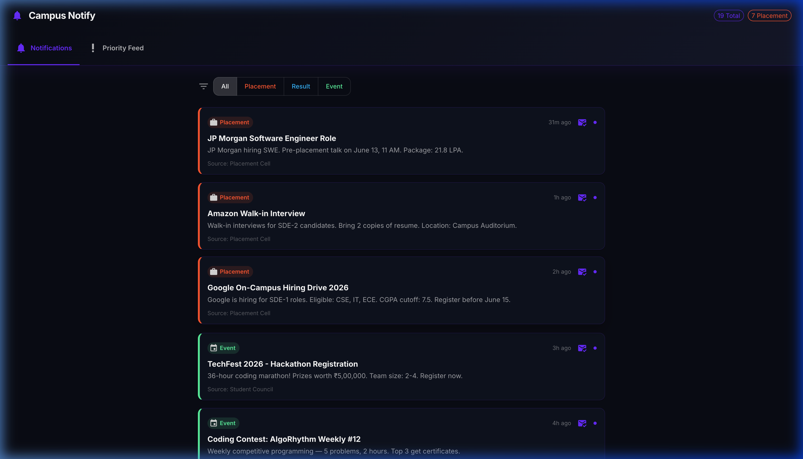
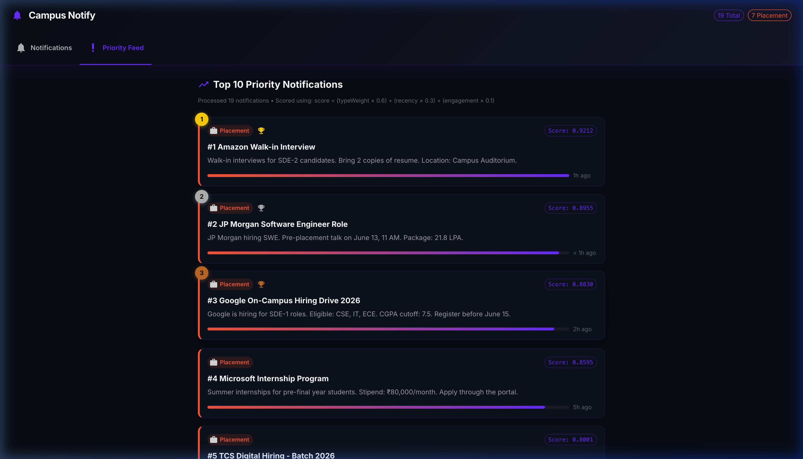
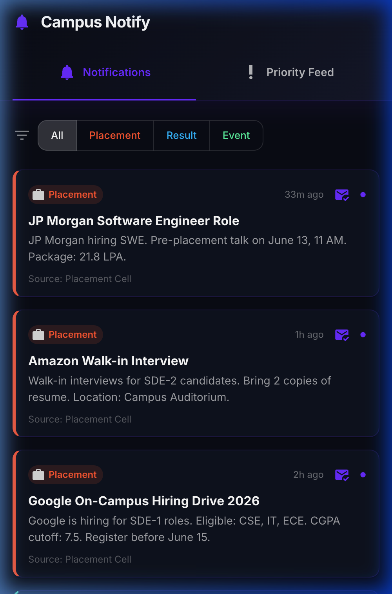

# 🔔 Campus Notification System

> AffordMed Campus Hiring Evaluation — Full-Stack Solution

A campus notification system that fetches, scores, and displays notifications with priority-based ranking using a **Min Heap** data structure.

---

## 📸 Screenshots

### Notifications Page (Desktop)


### Priority Feed (Desktop)


### Mobile Responsive View


---

## 🏗️ Project Structure

```
├── notification_system_design.md    ← Stage 1–5 (System Design)
├── schema.sql                       ← PostgreSQL schema with indexes
├── backend/                         ← Stage 6 (Node.js API)
│   └── src/
│       ├── index.js                 ← Express server
│       ├── routes/notifications.js  ← API endpoints
│       ├── services/
│       │   ├── fetchNotifications.js ← Data fetcher + cache
│       │   └── priorityEngine.js    ← Scoring + Min Heap
│       └── utils/MinHeap.js         ← Min Heap implementation
├── frontend/                        ← Stage 7 (React + MUI)
│   └── src/
│       ├── App.jsx                  ← Main app with tabs
│       ├── pages/
│       │   ├── NotificationsPage.jsx ← All notifications + filters
│       │   └── PriorityPage.jsx     ← Top 10 ranked feed
│       └── services/api.js          ← API client
└── screenshots/                     ← UI screenshots
```

---

## 🚀 Quick Start

### 1. Backend

```bash
cd backend
npm install
npm run dev
```

Backend runs at `http://localhost:3001`

### 2. Frontend

```bash
cd frontend
npm install
npm run dev
```

Frontend runs at `http://localhost:5173`

### 3. Environment Variables (optional)

Create `backend/.env`:

```
PORT=3001
API_URL=http://4.224.186.213/evaluation-service/notifications
AUTH_TOKEN=your_token_here
```

If the API is unreachable, the app uses built-in fallback data.

---

## 📚 Evaluation Stages

### Stage 1–5: System Design
See [`notification_system_design.md`](./notification_system_design.md) — covers:
- System architecture
- PostgreSQL schema with indexes
- REST API design
- Priority scoring algorithm
- Scalability & production considerations

### Stage 6: Backend API (Node.js)

**Endpoints:**

| Method | Endpoint | Description |
|--------|----------|-------------|
| `GET` | `/api/notifications` | All notifications (paginated, filterable) |
| `GET` | `/api/notifications/priority` | Top 10 by priority score |
| `GET` | `/api/notifications/stats` | Summary counts |

**Priority Scoring:**

```
score = (typeWeight × 0.6) + (recency × 0.3) + (engagement × 0.1)
```

| Type | Weight | Why |
|------|--------|-----|
| Placement | 1.0 | Career-critical |
| Result | 0.7 | Academic impact |
| Event | 0.4 | Informational |

**Recency** uses exponential decay (halves every 24 hours).  
**Min Heap** of size K for O(N log K) top-K extraction.

### Stage 7: Frontend (React + Material UI)

**Features:**
- 🔍 Filter by type (Placement / Result / Event)
- 📄 Pagination (6 items per page)
- 🏆 Priority feed with ranked cards + score bars
- 📱 Fully responsive (mobile + desktop)
- ✅ Read/Unread tracking via `localStorage`
- ⏳ Loading skeletons and error states
- 🌙 Dark theme

---

## 🛠️ Tech Stack

| Layer | Technology |
|-------|-----------|
| Frontend | React 19, Material UI 6, Axios |
| Backend | Node.js, Express |
| Build | Vite |
| Database | PostgreSQL (schema provided) |
| Data Structure | Min Heap |

---

## 📝 Notes

- The external API (`4.224.186.213`) requires an auth token. Add it to `backend/.env`.
- If the token is missing or the API is down, the app falls back to realistic sample data with 20 notifications across all three types.
- Read/unread state persists across page reloads using `localStorage`.
- No database setup needed to run — the SQL schema is provided separately for production deployment.
